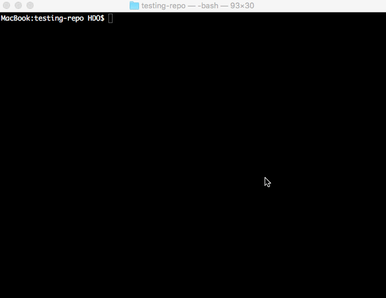

# Publish, please!

[](https://travis-ci.org/inikulin/publish-please)
[](https://www.npmjs.com/package/publish-please)
[](https://david-dm.org/inikulin/publish-please)

<p align="center">
<i>Safe and highly functional replacement for `npm publish`.</i>
</p>
<p align="center">
    
</p>

There are numerous ways to "shoot yourself in the foot" using `npm publish`. The purpose of this module is to replace
`npm publish` for your packages with safe and more functional alternative, which will allow you to:

 - Run tests or build steps before publishing (because `prepublish` is [broken](https://medium.com/greenkeeper-blog/what-is-npm-s-prepublish-and-why-is-it-so-confusing-a948373e6be1#.a40w9sdy6)).
 - Perform check for the [sensitive and non-essential data](#sensitive-information-audit) in your package to be sure that you didn't leak it by accident (Further reading: [Do not underestimate credentials leaks](https://github.com/ChALkeR/notes/blob/master/Do-not-underestimate-credentials-leaks.md)).
 - Perform check for vulnerable dependencies using `npm audit` data.
 - Check that you are in the correct git branch.
 - Check that git tag matches version specified in the `package.json`.
 - Check that there are no uncommitted changes in the working tree.
 - Check that there are no untracked files in the working tree.
 - Force usage of the [npm publish tag](https://docs.npmjs.com/cli/publish) there necessary, so you'll be sure you're not publishing preview version of your package as a release version.
 - Get release summary and publishing confirmation.
 - Configure publishing using built-in configuration wizard.

## Getting started ( [or use npx directly](#running-publish-please-with-npx) )

Setup process of *publish-please* is quite trivial - just run
```shell
npm install --save-dev publish-please
```
in your project's directory.

Once it finish installing, *publish-please* will automatically run it's configuration wizard, which will guide you
through some simple steps to setup [features](#options) you want to use:


If you forgot to configure something or just changed your mind and want to change configuration, just run
```shell
npm run publish-please config
```
to return to wizard.

So, once you've done with wizard from now on `npm publish` for your package is disabled (Muahahaha :smiling_imp:):


But don't worry it's done for the good reason to prevent you or your co-workers run unsafe publishing process. Use awesome version
instead:
```shell
npm run publish-please
```


## Options

 - **prePublishScript** - Specifies command that will be run before publish (e.g. `npm test`). Use it for builds and tests. Default: `npm test`.
 - **postPublishScript** - Specifies command that will be run after successful publishing. Use it for release announcements, creating a GitHub release, uploading binaries, etc. Default: `` (no command).
 - **publishCommand** - Specifies publishing command which will be used to publish the package. Default: `npm publish`.
 - **publishTag** - Specifies tag with which package will be published. See [npm publish docs](https://docs.npmjs.com/cli/publish) for more info. Default: `latest`.
 - **confirm** - Ask for the confirmation before publishing. Default: `true`.

### Validations
 - **uncommittedChanges** - Check that there are no uncommitted changes in the working tree. Default: `true`.
 - **untrackedFiles** - Check that there are no untracked files in the working tree. Default: `true`.
 - **gitTag** - Check that git tag matches version specified in the `package.json`. Default: `true`.
 - **branch** - Check that current branch matches the specified branch. Default: `master`.
    - You may also set the branch as a regular expression to be able to use publish-please in a multiple branches scenario like `master` and `release`:
        ```js
        /(master|release)/
        ``` 
 - **sensitiveData** - Perform [audit for the sensitive data](#sensitive-information-audit). Default: `true`.
 - **vulnerableDependencies** - Perform vulnerable dependencies check using `npm audit`. Default: `true` if npm version is 6.1.0 or above, `false` otherwise.
    - you may prevent specific vulnerabilities to be reported by publish-please by creating a `.auditignore` file in the root of your project with content like the following:

        ```yaml
        https://npmjs.com/advisories/12
        https://npmjs.com/advisories/577
        ```
    - you may perform vulnerabilities check only for a specific vulnerability level: `critical`, `high`, `moderate` or `low`. 
    To do this create an `audit.opts` file in the root of your project with content like the following:
        ```sh
        --audit-level=high
        ```
        The above example will enable to report only vulnerabilities of level `critical` and `high`


### Running in dry mode

You can execute publish-please in dry mode by using the `--dry-run` option:

```shell
npm run publish-please --dry-run
```

Instead of publishing, this will show (after all validations) the content of the package that will be sent to npm, so that you can inspect it to be sure everything is there.



In this mode, the **postPublishScript** script will not run, since there is no publication to the registry. 

It might be a good idea to add these two lines inside your .gitignore file:
```sh
package
*.tgz
```

## Running publish-please with npx

You can execute publish-please directly with npx:  
* **Publish in a dry-run mode**
```sh
npx publish-please --dry-run
```

* **Safely publish to the npm registry**
```sh
npx publish-please
```

* **Setup a configuration file in order to customise the publishing workflow**
```sh
npx publish-please config
```

## Sensitive and non-essential data audit
**Important note:** tool provides some very basic sensitive data check. Do not rely on it fully. Always perform manual checks for the
sensitive data in your packages.

Performed for the following items:

 - Configuration files
    - CI
    - eslint
 - Demo files
 - Example files
 - Log files
 - Private SSH key
 - Source files
 - Temp files
 - Test files
 - Zip files
    - Output of 'npm pack'

## Upgrading to latest publish-please version

- If you are running node 8 or above, and if you have in the `package.json` file an already existing `prepublish` script, you should rename that script to `prepublishOnly` after you have upgraded publish-please. 

- Run `npm help scripts` to get more details.

## Check out my other packages used by this tool
- [cp-sugar](https://github.com/inikulin/cp-sugar) - Some sugar for child_process module.
- [elegant-status](https://github.com/inikulin/elegant-status) - Create elegant task status for CLI.
- [pkgd](https://github.com/inikulin/pkgd) - Get package publish info: package.json and file list.
- [promisify-event](https://github.com/inikulin/promisify-event) - Promisify EventEmitter's event.

## Author
[Ivan Nikulin](https://github.com/inikulin) (ifaaan@gmail.com)
